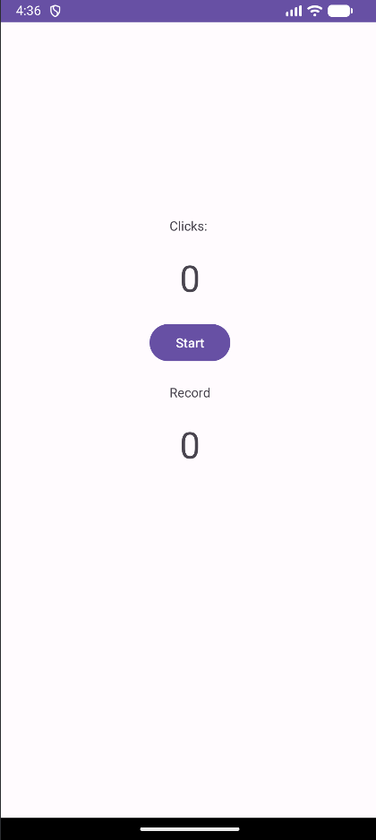
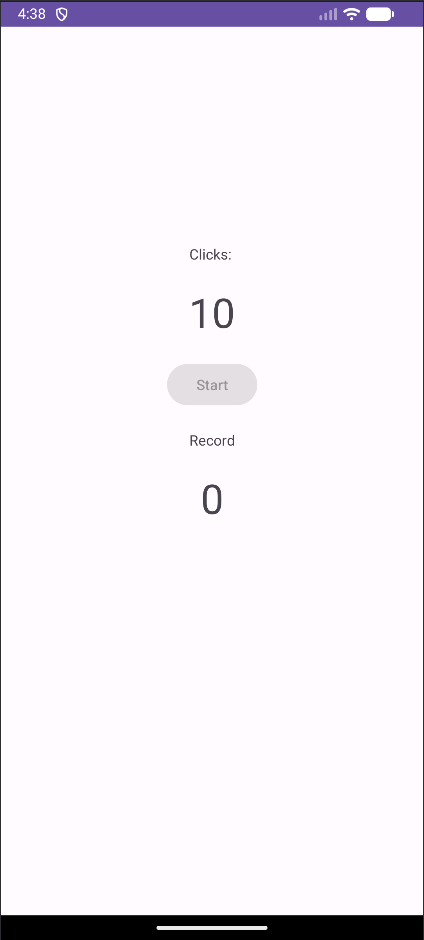
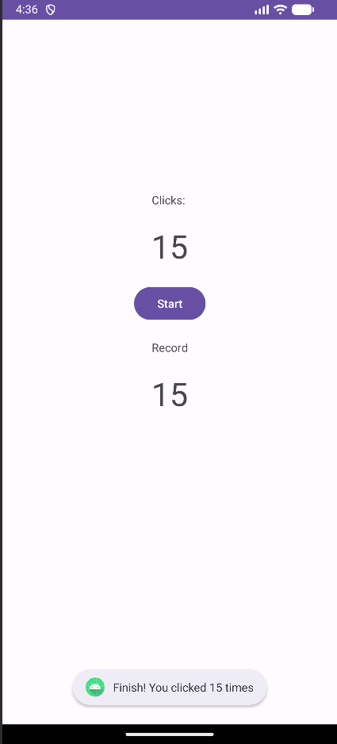

# TapSpeedChallenge ⚡

Aplikasi Android sederhana untuk menguji **kecepatan mengetuk layar** dalam waktu 3 detik.  
Dibuat tahun 2023 (iseng) menggunakan **Java** dan **Android Studio** dengan UI berbasis `ConstraintLayout`.

---

## 📱 Tentang Aplikasi

Permainan ketuk cepat (*tap challenge*) di mana kamu harus menyentuh layar sebanyak mungkin dalam batas waktu 3 detik.  
Setelah waktu habis, aplikasi akan menampilkan jumlah ketukan dan menyimpan rekor tertinggi secara lokal (selama sesi aplikasi berjalan).

---

## 🎮 Fitur

- ⏱️ Timer 3 detik otomatis
- 👆 Hitung jumlah ketukan pada area layar
- 🏆 Penyimpanan rekor (skor tertinggi) selama aplikasi hidup
- 🔘 Tombol Start untuk memulai/mengulang permainan
- 🍞 Notifikasi Toast saat permainan selesai

---

## 🧱 Struktur Proyek

```
TapSpeedChallenge/
├── app/
│   ├── src/main/java/com/example/project/
│   │   └── MainActivity.java
│   └── src/main/res/
│       ├── layout/
│       │   └── activity_main.xml
│       └── values/
│           └── dimens.xml  (opsional, berisi margin & ukuran teks)
├── gradle/wrapper/
│   └── gradle-wrapper.properties
├── build.gradle            (project-level)
└── settings.gradle
```

Komponen utama:
- **MainActivity.java** – Logika permainan, event click, handler timer.
- **activity_main.xml** – Tampilan antarmuka dengan ConstraintLayout.

---

## ⚙️ Cara Kerja

1. **Pengguna menekan tombol `Start`**
   - Hitungan klik di-reset ke 0.
   - Tombol `Start` dinonaktifkan agar tidak bisa ditekan lagi selama permainan.
   - Sebuah `Handler` dengan `postDelayed` dijalankan selama 3000 ms (3 detik).

2. **Selama 3 detik**, pengguna dapat menyentuh **area mana saja** pada layar (selain tombol).  
   Setiap sentuhan akan memanggil `onScreenClick()` yang menambah `clickCounter` dan memperbarui `TextView`.

3. **Setelah 3 detik**, method `onFinish()` dipanggil:
   - Menampilkan *Toast*: "Finish! You clicked X times"
   - Membandingkan `clickCounter` dengan `record`. Jika lebih besar, rekor diperbarui dan ditampilkan.
   - Tombol `Start` kembali diaktifkan.

---

## 🧩 Penjelasan Kode Utama

### MainActivity.java

```java
private int clickCounter = 0;
private int record = 0;
private boolean running = false;
```

- `clickCounter`: jumlah ketukan di sesi aktif.
- `record`: skor tertinggi yang pernah dicapai selama aplikasi berjalan.
- `running`: status permainan sedang berlangsung atau tidak.

```java
public void onStartButtonClick(View v) { ... }
```
Memulai permainan. Mengatur flag, mereset counter, dan menjadwalkan `onFinish()` setelah 3 detik.

```java
public void onScreenClick(View v) { ... }
```
Hanya berfungsi jika `running == true`. Menambah counter dan memperbarui UI.

```java
private void onFinish() { ... }
```
Menampilkan hasil, menyimpan rekor, dan mengizinkan permainan baru.

### activity_main.xml

- **ConstraintLayout** dengan atribut `android:onClick="onScreenClick"` agar seluruh area merespons sentuhan.
- `TextView` untuk label "Clicks:", nilai counter, "Record", dan nilai rekor.
- `Button` `startButton` dengan `android:onClick="onStartButtonClick"`.
- Ukuran teks counter/rekor menggunakan resource `@dimen/click_size` (opsional, bisa diganti langsung dengan `sp`).

---

## ▶️ Cara Menjalankan

1. Clone repo ini:
   ```bash
   git clone https://github.com/username/TapSpeedChallenge.git
   ```
2. Buka dengan **Android Studio** (versi Hedgehog atau lebih baru disarankan).
3. **Pastikan JDK 17 digunakan oleh Gradle** (lihat bagian Troubleshooting di bawah).
4. Sync Gradle, lalu jalankan di emulator atau perangkat fisik dengan API level minimal 21 (Lollipop).

---

## 🖼️ Pratinjau (Preview)



---

## 📝 Catatan

- Proyek ini dibuat hanya untuk hiburan dan latihan, **tidak** menggunakan database atau penyimpanan permanen.
- Rekor akan hilang saat aplikasi ditutup.  
  Silakan dikembangkan lebih lanjut, misalnya dengan `SharedPreferences` agar rekor tetap tersimpan.

---

## 🔧 Troubleshooting

Proyek ini menggunakan **Gradle 7.5 + Android Gradle Plugin 7.4.2**. Masalah umum yang mungkin muncul saat membuka di Android Studio versi terbaru:

### 1. `NoSuchMethodError: DependencyHandler.module` atau `FAILURE: Build failed...`
**Penyebab:** AGP 8.x tidak cocok dengan versi Gradle yang terpasang.

**Solusi:**
Pastikan dua file ini berisi:

- **`gradle/wrapper/gradle-wrapper.properties`**
  ```properties
  distributionUrl=https\://services.gradle.org/distributions/gradle-7.5-bin.zip
  ```

- **`build.gradle` (root project)**
  ```groovy
  plugins {
      id 'com.android.application' version '7.4.2' apply false
      id 'com.android.library' version '7.4.2' apply false
  }
  ```

### 2. `Unsupported class file major version 65` atau `incompatible Java 21`
**Penyebab:** Java 21 (atau 20+) tidak kompatibel dengan Gradle 7.5. Maksimal yang didukung adalah Java 18.

**Solusi:** Ganti JDK yang digunakan Android Studio menjadi **JDK 17**.

#### Cara mengganti JDK di Android Studio:
- Buka **Settings** (`File → Settings` di Windows/Linux, `Android Studio → Preferences` di macOS)
- Masuk ke **Build, Execution, Deployment → Build Tools → Gradle**
- Pada bagian **Gradle JDK**, pilih **jbr-17** atau **JDK 17**.  
  *(Jika tidak ada, klik "Download JDK…", pilih versi 17, vendor Eclipse Temurin, lalu download)*
- Klik **Apply** lalu **OK**

#### Membersihkan cache Gradle:
Jalankan perintah berikut di terminal Android Studio (atau direktori proyek):
```bash
./gradlew --stop
```
Lalu hapus folder tersembunyi `.gradle` di root proyek.

Setelah itu, lakukan **Sync Project with Gradle Files** (`File → Sync...`) dan build akan berhasil.

---

## 📄 Lisensi

Proyek ini bebas digunakan untuk keperluan belajar. Tidak ada lisensi khusus.

*Dibuat dengan ☕ dan iseng oleh [namamu] pada 2023.*
